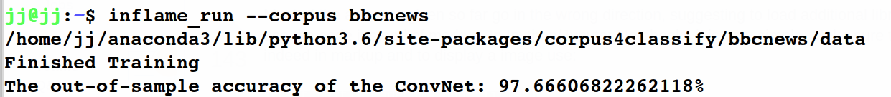
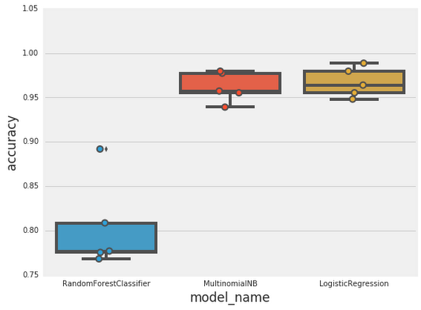

### **TL;DR**
Deep learning architectures for text classification are the “Wild West” of deep learning. We present a simple way to finesse a convolutional neural network into a text classifier that attains good results right out the gate.

### **Table of Contents**
1. [Introduction](#intro)
2. [An Instructive Comparison](#comparison)
3. [Designing Convolutional Layers](#design)
4. [Automate Dimension Calculations to Reduce Mistakes](#dimension)
5. [Results](#results)

### **1. Introduction** <a name="intro"></a>
In this article, we'll examine how PyTorch convolutional networks work in the text classifier context. Text classification is pivotal to applications such as sentiment analysis, fraud detection, and customer interaction analytics. Yet until recently, mainstream models for text classification consisted of TF-IDF processing joined together with SVM or naive bayes. The paper that pushed this frontier is [“Convolutional Neural Networks for Sentence Classification”](https://arxiv.org/abs/1408.5882). Its key contribution was co-opting for NLP the convolutional neural network architecture developed for computer vision. While convolutional net is technique par excellence in computer vision, how do you translate its image related constructs to the peculiarities of language modeling? There is no definitive way to answer that yet, but we show here that a fairly straightforward ConvNet structure can obtain good results.

### **2. An Instructive Comparison** <a name="comparison"></a>
The following table draws attention to where the key elements of ConvNet architecture differ between Computer Vision and Text Classification. In one column, it lists the typical settings for Computer Vision. By contrast, the settings for Text Classification are original creations that we're unveiling in this article. Further explanation of these settings will follow later. 

<div>
<style scoped>
    .dataframe tbody tr th:only-of-type {
        vertical-align: middle;
    }

    .dataframe tbody tr th {
        vertical-align: top;
    }

    .dataframe thead th {
        text-align: right;
    }
</style>
<table border="1" class="dataframe">
  <thead>
    <tr style="text-align: right;">
      <th></th>
      <th>Computer Vision</th>
      <th>Text Classification</th>
    </tr>
  </thead>
  <tbody>
    <tr>
      <th>Input</th>
      <td>pixels</td>
      <td>words</td>
    </tr>
    <tr>
      <th>Channels</th>
      <td>3 RGB channels</td>
      <td>dimensions of word embedding</td>
    </tr>
    <tr>
      <th>Kernel</th>
      <td>n by n filters</td>
      <td>n by n filters</td>
    </tr>
  </tbody>
</table>
</div>

### **3. Designing Convolutional Layers** <a name="design"></a>
The first 2 layers of our network look like the following:

```python
# The 1st Layer:
Conv1d(channels, # 1 channel for each dimension of word embedding
       8, 
       kernel_size, 
       stride,
       padding
      ),
ReLU(),
MaxPool1d(2),

# The 2nd Layer:
Conv1d(8, 
       16, 
       kernel_size,
       stride, 
       padding
      ),
ReLU(),
MaxPool1d(2)
```

It's important to understand that the "channels" parameter in deep learning is really just another dimension of the data. So for black-and-white images, each observation is a matrix of pixels. But for colored images, each observation is a tensor made of pixels + RGB value (red/green/blue).

Now for NLP, we let each channel be a dimension of the word embedding. Consequently, each observation is a matrix composed of the word vector (i.e. embedding) of each word in that text. This is why we use Conv1d as opposed to Conv2d.

### **4. Automate Dimension Calculations to Reduce Mistakes** <a name="dimension"></a>
A common error when building ConvNet models is dimensions not lining up between layers. This can be avoided through automating as much of the dimension calculations as possible. For example, we used the following code to calculate the number of extracted features.

```python
def n_extracted_features(conv_layers, input_length, last_out_channel):
   '''Helper function for creating the attribute "self.N_EXTRACTED_FEATURES"
   that computes the numbers of nodes to feed into the flat, fully connected layer.
   '''
   N_LAYERS = len(conv_layers) / 3

   # validate input
   if input_length % 2**N_LAYERS != 0:
       raise Exception('input_length should evenly divide 2**N_LAYERS.')

   POOLED_DIM = input_length / 2**N_LAYERS

   return int(last_out_channel * POOLED_DIM)
```

### **5. Results** <a name="results"></a>
To get a sense of the ConvNet architecture's performance, we will train a ConvNet classifier on the [BBC News dataset](http://mlg.ucd.ie/datasets/bbc.html). For convenient benchmarking, this data was already [analyzed in a text classification tutorial by Google](https://cloud.google.com/blog/products/gcp/problem-solving-with-ml-automatic-document-classification), where they explored three different machine learning models: random forest, naive bayes, and logistic regression. We'll see how our deep learning model stacks up.

The quick way to run our model is to take advantage of its PyPI distribution and predefined console script. Like this:

```sh
pip install inflame
inflame_run --corpus bbcnews
```

The following side-by-side comparison suggests that our convolutional neural network's 97% accuracy is on a par with classic machine learning. 

Convolutional Neural Network  |  Classic ML
------------------------------|----------------------------
          |  

The takeaway here is that a convolutional neural network is in fact a solid model choice for text classification. With machine learning models that require TF-IDF feature engineering, not all sentence structure subtleties are accounted for. Deep learning's ability to incorporate word embeddings efficiently and in a streamlined way is one of its key advantages. Finally, even minimally tuned deep learning models perform favorably to other types of models. In another experiment where a more sophisticated GloVe embedding was used, the deep neural network trounced all other types of machine learning models in terms of accuracy. Deep learning's stronghold in the NLP landscape will be here for quite a while.

Thanks for reading. [This Github repo](https://github.com/zjohn77/inflame) houses all code necessary for replication of this article. Feedback is welcome.